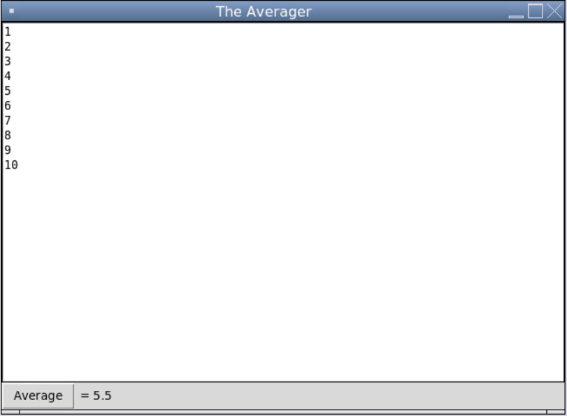

# Lab 32 - Averager GUI

In this lab you will be creating a GUI application that will allow a user to type in a list of numbers, click a button, and see the average of their numbers.  A sample is below.

### Minimum Requirements

   - Use both the `grid` and `pack` geometry managers.
   - You may not have all widgets in a single row or column.
   - You must use at least one each of Text, Frame, Button, and Label widgets.
   - The user should be able to type in a list of numbers (including decimals) and get a decimal average when the button is clicked.  Round the result to a reasonable number of decimal places.
   - Give your window a title.
   - You may assume only numbers (integers or floats) are entered in the text box, one per line.
   
### Tips

   - [Tkinter Text Box](https://www.geeksforgeeks.org/python-tkinter-text-widget/)
   - If you're stuck on how to get the average, one way to do the averaging function is to read the whole text box, use the `split` function to make a list from the text, then loop through the list to determine the average.
